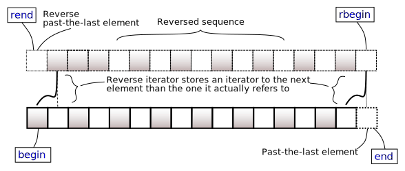
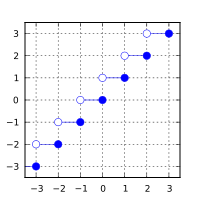
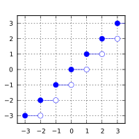
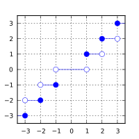

# STL
## 模板类
### vector
#### 使用条件
```cpp
#include <vector>
using namespace std;
```
#### 初始化
```cpp
vector<int> v(10);  // 创建10个元素的数组v，初始化为默认值(0)
vector<int> v(10, 2);  // 创建10个元素的数组v，初始化为2
vector<int> v = {1, 2, 3, 4, 5};  // 使用数组初始化
vector<int> v2(v.begin(), v.end());
```
#### 访问元素的方法
1. 通过下标：`v[i]`；
2. 通过迭代器：`*(v.begin() + i)`。
#### 成员函数
```cpp
vector& operator=(const vector& other);  // 赋值给容器
void assign(size_type count, const T& value);  // 可以对已经初始化的容器重新赋值
```
##### 元素访问
```cpp
reference at(size_type pos);  // 返回pos位置元素的引用，带边界检查
reference operator[](size_type pos);
reference front();  // 访问第一个元素
reference back();  // 访问最后一个元素
T* data();  // 返回指向内存中数组第一个元素的指针
```
##### 迭代器
```cpp
iterator begin();  // 返回指向起始的迭代器
iterator end();  // 返回指向末尾的迭代器
reverse_iterator rbegin();  // 返回指向起始的逆向迭代器
reverse_iterator rend();  // 返回指向末尾的逆向迭代器
```
##### 容量
```cpp
bool empty();  // 检查容器是否为空
size_type size();  // 返回容纳的元素数
size_type max_size();  // 返回根据系统或库实现限制的容器可保有的元素最大数量
void reserve(size_type new_cap);  // 增加vector的容量到大于或等于new_cap的值。不会修改size。若new_cap > capacity，则会重新分配存储空间，且所有迭代器失效。
size_type capacity();  // 返回容器当前已为之分配空间的元素数
```
##### 修改器
```cpp
void clear();  // 清除所有元素，size变为0，capacity不变。
iterator insert(iterator pos, const T& value);  // 插入元素，返回指向被插入value的迭代器
iterator insert(const_iterator pos, size_type count, const T& value);  // 插入count个value，返回第一个被插入元素的迭代器，若count == 0返回pos
iterator erase(iterator pos);  // 移除位于pos的元素
iterator erase(iterator first, iterator last);  // 移除范围[first, last)中的元素
void push_back(const T& value);  // 将元素添加到容器末尾，初始化新元素为value的副本
void push_back(T&& value);  // 移动value进新元素
template< class... Args >  
constexpr reference emplace_back(Args&&... args);  // 将元素添加到容器末尾，返回被插入元素的引用
void pop_back();  // 移除容器的末元素
void resize(size_type count);  // 重设容器大小以容纳count个元素
void swap(vector& other);  // 将内容与other的交换
```

>[!tip] 关于逆向迭代器的说明图和使用示例。
>

>[!example]
>```cpp
> for (auto it = v.rbegin(); it != v.rend(); ++it) {  // 使用逆向迭代器遍历数组
>     cout << *it << endl;
> }
> ```

### stack
使用条件：
```cpp
#include <stack>
using namespace std;
```
**成员函数**：
```cpp
stack& operator=(const stack& other);  // 复制赋值运算符
stack& operator=(stack&& other);  // 移动赋值运算符
// 元素访问
reference top();  // 返回到栈顶元素的引用
// 容量
bool empty();
size_type size();  // 返回容纳的元素数
// 修改器
void push(const T& value);
void push(T&& value);
template< class... Args >  
void emplace(Args&&... args);  // 在栈顶原位构造元素
void pop();
void swap(stack& other);  // 交换容器适配器与other的内容
```
### queue
使用条件：
```cpp
#include <queue>
using namespace std;
```
**成员函数**：
```cpp
queue& operator=(const queue& other);
queue& operator=(queue&& other);
// 元素访问
reference front();
reference back();
// 容量
bool empty();
size_type size();
// 修改器
void push(const value_type& value);
void push(value_type&& value);
template< class... Args >  
void emplace(Args&&... args);
void pop();
void swap(queue& other);
```
### deque
使用条件：
```cpp
#include <deque>
using namespace std;
```
**成员函数**：
```cpp
deque& operator=(const deque& other);
deque& operator=(deque&& other);
void assign(size_type count, const T& value);
// 元素访问
reference at(size_type pos);  // 访问指定的元素，同时进行越界检查
regerence operator[](size_type pos);
reference front();
reference back();
// 迭代器
iterator begin();
iterator end();
reverse_iterator rbegin();
reverse_iterator rend();
// 容量
bool empty();
size_type size();
size_type max_size();
// 修改器
void clear();
iterator insert(iterator pos, const T& value);
iterator insert(iterator pos, size_type count, const T& value);
template< class... Args >  
iterator emplace(const_iterator pos, Args&&... args);
iterator erase(iterator pos);
iterator erase(iterator first, iterator last);
void push_back(const T& value);
void push_back(T&& value);
template< class... Args >  
reference emplace_back(Args&&... args);
void pop_back();
void push_front(...);
reference emplace_front(...);
void pop_front();
void resize();
void swap(deque& other);
```
### priority_queue
使用条件：
```cpp
#include <queue>
using namespace std;
```
**成员函数**：
```cpp
priority_queue& operator=(const priority_queue& other);
priority_queue& operator=(priority_queue&& other);
// 元素访问
const_reference top() const;
// 容量
bool empty() const;
size_type size() const;
// 修改器
void push(const T& value);
template< class... Args >  
void emplace(Args&&... args);
void pop();
void swap(priority_queue& other);
```
#### 优先级的设置
默认提供==最大元素==的查找。
对于基本数据类型如`int`，`char`，`double`，可以直接使用。
区分`less`与`greater`：从堆根开始向下比较，大根堆值变小，小根堆值变大。堆排序中数组升序排列时要使用大根堆。
```cpp
priority_queue<int> q;  // 大根堆
priority_queue<int, vector<int>, less<int>> q;  // 大根堆
priority_queue<int, vector<int>, greater<int>> q;  // 小根堆
```
对于结构体，通过重载`<`实现。例如：
```cpp
struct fruit {
    string name;
    int price;
    friend bool operator<(const fruit& f1, const fruit& f2) {  // 不能省略const
        return f1.price < f2.price;  // 这里改为>则是价格低的水果优先级高
    }
    // 或
    friend bool operator<(fruit f1, fruit f2) {
        return f1.price < f2.price;
    }
    // 另一种方法
    bool operator<(const fruit& f) const {  // 两个const都不能省略
        return price < f.price;
    }
};
priority_queue<fruit> q;  // 价格高的水果优先级高
```
也可以单独使用结构体实现比较函数。
```cpp
struct cmp {  // 效果等同于重载<
    bool operator()(fruit& f1, fruit& f2) {
        return f1.price < f2.price;  // 改成>则是价格低的优先级高
    }
};
priority_queue<fruit, vector<fruit>, cmp> q;  // 这样实现的cmp效果为价格高的优先级高
```
### string
#### 使用条件
```cpp
#include <string>
using namespace std;
```
#### 初始化/构造函数
```cpp
string str = "Hello World.";  // 直接用=初始化
string(size_type count, char ch);  // 长度为count，用字符ch填充
string(const char* s, size_type count);  // 以s所指向的字符串的首count个字符构造string
string(const char* s);  // 以首个空字符('\0')确定字符串的长度
string(string& other, size_type pos, size_type count = string::npos);  // 以other的子串[pos, pos+count)构造string，若不指定count，范围是[pos, other.size())
string(const string& other);  // 复制构造函数
```
#### 常量
```cpp
static const size_type npos = -1;  // 对于无符号整数相当于最大值
```
#### 成员函数：
```cpp
string& operator=(const string& str);
string& operator=(const char* s);
string& operator=(char ch);  // 不能在初始化时使用
string& assign(size_type count, char ch);
string& assign(const string& str);
string& assign(const string& str, size_type pos, size_type count = npos);
string& assign(const char* s, size_type count);  // [s, s + count)
string& assign(const char* s);
```
##### 元素访问
```cpp
char& at(size_type pos);  // 访问指定字符，有边界检查
char& operator[](size_type pos);  // 访问指定字符
char& front();
char& back();
const char* data() const;  // 返回指向字符串首字符的指针
const char* c_str() const;  // 同上
```
##### 迭代器
```cpp
iterator begin();
iterator end();
reverse_iterator rbegin();
reverse_iterator rend();
```
##### 容量
```cpp
bool empty();
size_type size();
size_type length();
size_type max_size();  // 返回string由于保有系统或库实现限制所能保有的最大元素数
void reserve(size_type new_cap);
size_type capacity();
void shrink_to_fit();  // 请求移除未使用的容量。这是减少capacity()到size()的非强制请求，是否满足请求依赖于实现
```
##### 操作
```cpp
void clear();
string& insert(size_type index, size_type count, char ch);
string& insert(size_type index, const char* s);  // 以空字符'\0'结束
string& insert(size_type index, const char* s, size_type count);  // [s,s+count)可以含有空字符
string& insert(size_type index, const string& str);
string& insert(size_type index, const string& str, size_type index_str, size_type count);
iterator insert(iterator pos, char ch);
iterator insert(iterator pos, size_type count, char ch);
string& erase(size_type index = 0, size_type count = npos);  // 返回*this
iterator erase(iterator pos);  // 返回被擦除字符后随字符的迭代器或end()
iterator erase(iterator first, iterator last);  // 擦除[first, last)，返回擦除前last指向字符的迭代器或end()
void push_back(char ch);
void pop_back();
string& append(size_type count, char ch);
string& append(const string& str);
string& append(const string& str, size_type pos, size_type count);
string& append(const char* s, size_type count);
string& append(const cahr* s);
string& operator+=(const string& str);
string& operator+=(char ch);
string& operator+=(const char* s);
bool starts_with(char ch);  // 检查ch是否为前缀
bool starts_with(const char* s);  // 检查空终止字符串s是否为前缀
bool ends_with(char ch);  // 检查后缀
bool ends_with(const char* s);
string substr(size_type pos = 0, size_type count = npos);  // 子串[pos, pos+count) 
size_type copy(char* dest, size_type count, size_type pos = 0);  // 复制子串[pos, pos+count)到dest所指向的字符串
void resize(size_type count);
void resize(size_type count, char ch);
void swap(string& other);  // 交换string的内容
// 以新字符串替换[pos, pos + count)或[first, last)所指示的string部分
string& replace(size_type pos, size_type count, const string& str);
string& replace(const_iterator first, const_iterator last, const string& str);
string& replace(size_type pos, size_type count, const basic_string& str, 
                size_type pos2, size_type count2 = npos);
string& replace(size_type pos, size_type count, const char* cstr, size_type count2);
string& replace(const_iterator first, const_iterator last, 
                const char* cstr, size_type count2);
string& replace(size_type pos, size_type count, const char* cstr);
string& replace(const_iterator first, const_iterator last, const char* cstr);
string& replace(size_type pos, size_type count, size_type count2, char ch);
string& replace(const_iterator first, const_iterator last, size_type count2, char ch);
// 比较2个字符序列
int compare(const string& str);
int compare(size_type pos1, size_type count1, const string& str);
int compare(size_type pos1, size_type count1, const basic_string& str, 
            size_type pos2, size_type count2 = npos);
int compare(const char* s);
int compare(size_type pos1, size_type count1, const char* s);
int compare(size_type pos1, size_type count1, const char* s, size_type count2);
```
>[!tip] compare
>按下列方式比较始于 `data1` 的 `count1` 个字符组成的字符序列与始于 `data2` 的 `count2` 个字符组成的字符序列。首先，用 `size_type rlen = min(count1, count2)` 计算要比较的字符数。然后调用 `Traits::compare(data1, data2, rlen)` 比较序列。对于标准字符特性，此函数进行逐字符字典序比较。若结果为零（到此为止的字符序列相等），则按下列方式比较其大小：
>
### set, unordered_set
#### set
使用条件：
```cpp
#include <set>
using namespace std;
```
**成员函数**：
```cpp
set& operator=(const set& other);
// 迭代器
iterator begin();
iterator end();
reverse_iterator rbegin();
reverse_iterator rend();
// 容量
bool empty();
size_type size();
size_type max_size();  // 返回根据系统或库实现限制的容器可保有的元素最大数量
// 修改器
void clear();
std::pair<iterator, bool> insert(const value_type& value);
template< class... Args >
std::pair<iterator,bool> emplace(Args&&... args);
iterator erase(iterator pos);  // 返回后随最后被移除的元素的迭代器
iterator erase(iterator first, iterator last);  // 移除范围[first, last)中的元素
size_type erase (const key_type& key);  // 删除值为key的元素，返回成功删除的个数
void swap(set& other);
// 查找
size_type count(const Key& key);  // 返回匹配特定键的元素数量，因为容器不允许重复故为1或0
iterator_find(const Key& key);
bool contains(const Key& key);  // 检查容器是否含有带特定键的元素
iterator lower_bound(const Key& key);  // 返回指向首个不小于key的元素的迭代器，若找不到返回end()
iterator upper_bound(const Key& key);  // 返回指向首个大于key的元素的迭代器，若找不到返回end()
```
#### unordered_set
使用条件：
```cpp
#include <unordered_set>
using namespace std;
```
**成员函数**：
```cpp
unordered_set& operator=(const unordered_set& other);
// 迭代器
const_iterator begin() const;
const_iterator end() const;
// 容量
bool empty();
size_type size();
size_type max_size();
// 修改器
void clear();
std::pair<iterator, bool> insert(const value_type& value);
template< class... Args >
std::pair<iterator, bool> emplace(Args&&... args);
iterator erase(const_iterator pos);
iterator erase(const_iterator first, const_iterator last);
size_type erase(const key_type& key);
void swap(unordered_set& other);
// 查找
size_type count(const Key& key);  // 返回匹配特定键的元素数量，因为容器不允许重复故为1或0
iterator find(const Key& key);
bool contains(const Key& key);
```
### map, unordered_map
#### map
使用条件：
```cpp
#include <map>
using namespace std;
```
元素访问：
```cpp
class Key;  // 键
class T;  // 值
map<Key, T> mp;  // 定义容器
```
1. 通过下标访问：`T& operator[](const Key& key)`
2. 通过at函数，带边界检查：`T& at(const Key& key)`
3. 通过迭代器访问：`map<Key, T>::iterator it`，通过`it->first`访问键，`it->second`访问值。
> [!example]
> ```cpp
> map<char, int> mp;
> mp['m'] = 1;  // 可以直接插入元素
> mp['p'] = 2;
> for (mam<char, int>::iterator it = mp.begin(); it != mp.end(); ++it) {
>     cout << it->first << " : " << it->second << endl;
> }
> ```

**成员函数**：
```cpp
map& operator=(const map& other);
T& operator[](const Key& key);  // 返回到映射到等于key的键的值的引用，若键不存在则进行插入
// 迭代器
iterator begin();
iterator end();
reverse_iterator rbegin();
reverse_iterator rend();
// 容量
bool empty();
size_type size();
size_type max_size();
// 修改器
void clear();
iterator erase(iterator pos);
iterator erase(iterator first, iterator last);
size_type erase(const key_type& key);
void swap(map& other)
// 查找
size_type count(const Key& key);  // 返回匹配特定键的元素数量，容器不允许重复故为1或0
iterator find(const Key& key);
bool contains(const Key& key);
std::pair<iterator, iterator> equal_range(const Key& key);  // 返回容器中所有拥有给定关键的元素范围。范围以2个迭代器定义，一个指向首个不小于key的元素，另一个指向首个大于key的元素
iterator lower_bound(const Key& key); // 返回指向首个不小于key的元素的迭代器
iterator upper_bound(const Key& key);  // 返回指向首个大于key的元素的迭代器
```
#### unordered_map
使用条件：
```cpp
#include <unordered_map>
using namespace std;
```
**成员函数**：
```cpp
unordered_map& operator=(const unordered_map& other);
// 迭代器
iterator begin();
iterator end();
// 容量
bool empty();
size_type size();
size_type max_size();
// 修改器
void clear();
iterator erase(const_iterator pos);
iterator erase(const_iterator first, const_iterator last);
size_type erase(const key_type& key);
void swap(unordered_map& other);
// 查找
T& at(const Key& key);
T& operator[](const Key& key);
size_type count(const Key& key);  // 返回1或0
iterator find(const Key& key);
bool contains(const Key& key);
std::pair<iterator, iterator> equal_range(const Key& key);  // 返回容器中所有键等于key的元素范围。范围以2个迭代器定义，第一个指向所需范围的首元素，而第二个指向范围的尾后一位元素
```
### pair
`std::pair`是类模板，提供在一个单元存储两个相异类型对象的途径，是`std::tuple`的拥有两个元素的特殊情况。
使用条件：
```cpp
#include <utility>  // 在map头文件中会被引用
using namespace std;
```
**成员对象**：
```cpp
template<class T1, class T2>
struct pair {
    T1 first;
    T2 second;
};

pair<int, int> p;
```
直接使用`p.first`和`p.second`访问元素。
**成员函数**：
```cpp
pair();
pair(const T1& x, const T2& y);
template< class U1, class U2 >
pair(const pair<U1, U2>& p);
pair& operator=(const pair& other);
template< class U1, class U2 >
pair& operator=(const pair<U1,U2>& other);
void swap(pair& other);
```
**非成员函数**：
```cpp
// 构造std::pair对象，从参数类型推导目标类型
template< class T1, class T2 >
constexpr std::pair<V1,V2> make_pair(T1&& t, T2&& u);
```
应用：
1. 替代二元结构体及其构造函数；
2. 作为map的键值对插入。

> [!example]
> ```cpp
> map<string, int> mp;
> mp.insert({ "alpha", 1 });
> mp.insert(make_pair("beta", 2));
> mp.insert(pair<string, int>("gamma", 3));
> ```

### bitset
类模板`bitset`表示一个`N`位的固定大小序列。可以用标准逻辑运算符操作位集，并将它与字符串和整数相互转换.模板形参`N`是要为 `bitset` 分配存储的位数。
使用条件：
```cpp
#include <bitset>
using namespace std;

bitset<100> bset;  // 分配100位
```
**成员函数**：
```cpp
bitset();  // 默认构造函数。构造所有位设为零的 bitset
bitset(unsigned long long val);  // 构造bitset，初始化其首（最右、最低）M位位置为对应val的位值，其中M是unsigned long long的位数和正在构造的bitset中的位数N的较小者。其他位赋0
bitset(const char* str, typename std::string::size_type n = std::string::npos,
       char zero = CharT('0'), char one = CharT('1'));  // 使用字符串构造，n为使用字符数
bool operator==(const bitset<N>& rhs) const;  // 若*this与rhs中的所有位相等则返回true
// 元素访问
bool operator[](std::size_t pos) const;
reference operator[](std::size_t pos);
bool test(size_t pos) const;  // 返回位于位置pos的位的值
bool all();  // 检查是否全部位被设为 true
bool any();  // 检查是否任一位被设为 true
bool none();  // 检查是否无位被设为 true
std::size_t count() const;  // 返回被设为true的位数
// 容量
std::size_t size() const;  // 返回bitset所能保有的位数，即模板形参N
// 修改器
bitset<N>& operator&=(const bitset<N>& other);  // 二进制与
bitset<N>& operator|=(const bitset<N>& other);  // 二进制或
bitset<N>& operator^=(const bitset<N>& other);  // 二进制异或
bitset<N> operator~() const;  // 二进制非
bitset<N> operator<<(std::size_t pos) const;  // 二进制左移
bitset<N>& operator<<=(std::size_t pos);  // 当前对象左移
bitset<N> operator>>(std::size_t pos) const;  // 二进制右移
bitset<N>& operator>>=(std::size_t pos);  // 当前对象右移
bitset<N>& set();  // 设置所有位为true
bitset<N>& set(std::size_t pos, bool value = true);  // 设置pos位为value
bitset<N>& reset();  // 设置所有位为false
bitset<N>& reset(std::size_t pos);  // 设置pos位为false
bitset<N>& flip();  // 翻转所有位
bitset<N>& flip(std::size_t pos);  // 翻转pos位
// 转换
std::string to_string(char zero = '0', char one = '1') const;  // 转换bitset的内容为string。用zero表示拥有值false的位，以one表示拥有值 true 的位。产生的字符串含N个字符，其首字符对应最末（第N-1）位，其尾字符对应首位。 
unsigned long to_ulong() const;  // 转换bitset的内容为unsigned long整数。bitset的首位对应数的最低位，而尾位对应最高位。
unsigned long long to_ullong() const;  // 转换bitset的内容为unsigned long long整数。bitset的首位对应数的最低位，而尾位对应最高位。 
```
> [!Tip]
> 1. `&=` 、`|=` 、 和`^=` 仅对拥有相同大小 `N` 的 `bitset` 定义。
> 2. 返回值是否带引用，带引用可能会修改原位集。

**非成员函数**：
```cpp
template< std::size_t N >
bitset<N> operator&(const bitset<N>& lhs, const bitset<N>& rhs);  // 二进制与
template< std::size_t N >
bitset<N> operator|(const bitset<N>& lhs, const bitset<N>& rhs);  // 二进制或
template< std::size_t N >
bitset<N> operator^(const bitset<N>& lhs, const bitset<N>& rhs);  // 二进制异或
```
## 头文件algorithm
### max，min，minmax
比较两个输入的大小，返回最大值、最小值，或按照`{min, max}`的顺序返回`pair`。
```cpp
template<class Type>
constexpr const Type& max(const Type& left, const Type& right);
template<class Type>
constexpr const Type& min(const Type& left, const Type& right);
// 比较两个输入参数，并按较小到较大的顺序将它们作为参数对返回。
template<class Type>
constexpr pair<const Type&, const Type&> minmax(const Type& left, const Type& right);
```
### swap
交换两个对象的值。
```cpp
template<class Type>
void swap(Type& left, Type& right);
```
### reverse
反转`[left, right)`中的元素，可用于数组或容器。
```cpp
template<class BidirectionalIterator>
void reverse(BidirectionalIterator first, BidirectionalIterator last);
```
> [!example]
> ```cpp
> int a[10] = { ... };
> reverse(a, a + 4);  // 反转a[0] ~ a[3]
> string s = "Hello...";
> reverse(s.begin() + 1, s.begin() + 3);  // 反转s[1] ~ s[2]
> ```
### next_permutation
重新排序范围中的元素，以便使用按字典顺序的下一个更大排列（如果存在）替换原有排
序。
如果按字典顺序的下一个排列存在并且已替换范围的原始顺序，则返回`true`；否则返回`false`。这种情况下，顺序转换为按字典顺序最小的排列。
```cpp
template<class BidirectionalIterator>
bool next_permutation(BidirectionalIterator first, BidirectionalIterator last);
```
> [!example]
> ```cpp
> int a[3] = {1, 2, 3};
> next_permutation(a, a + 3);  // a[3] = {1, 3, 2}
> next_permutation(a, a + 3);  // a[3] = {2, 1, 3}
> ```
### fill
将区间`[first, last)`中的元素赋值。与`memset`只能赋值为0或-1不同，`fill`可以赋值为任意合法值。
```cpp
template<class ForwardIterator, class Type>
void fill(ForwardIterator first, ForwardIterator last, const Type& value);
```
#### memset
按照字节赋值，对`[s, s + n)`中的每个字节赋值为c，一般c取值为**0或-1**，分别用来赋值为（所有位）全0或全1。
```cpp
#include <cstring>
void* memset(void* s, int c, size_t n);
```
### sort，is_sorted
对区间`[first, last)`进行排序，或检查是否按照升序排列。
```cpp
template<class RandomAccessIterator>
void sort(RandomAccessIterator first, RandomAccessIterator last);
template<class RandomAccessIterator, class Compare>
void sort(RandomAccessIterator first, RandomAccessIterator last, Compare pred);
template<class ForwardIterator>
bool is_sorted(ForwardIterator first, ForwardIterator last);
template<class ForwardIterator, class Compare>
bool is_sorted(ForwardIterator first, ForwardIterator last, Compare pred);
```
只有对数组、容器中的`vector` `deque` `string`才可以排序。
```cpp
// 自定义比较函数，这里>效果为降序排列
bool UDgreater(int elem1, int elem2) { return elem1 > elem2; }

int main() {
    using namespace std;
    vector<int> v;

    for (int i = 0 ; i <= 5 ; i++ ) v.push_back( 2 * i );
    for (int j = 0 ; j <= 5 ; j++ ) v.push_back( 2 * j + 1 );
    // Original vector v1 = ( 0 2 4 6 8 10 1 3 5 7 9 11 )
    sort(v.begin(), v.end());
    // Sorted vector v1 = ( 0 1 2 3 4 5 6 7 8 9 10 11 )
    
    // 降序排列，使用greater<int>
    sort(v.begin(), v.end(), greater<int>());
    // Resorted (greater) vector v1 = ( 11 10 9 8 7 6 5 4 3 2 1 0 )
    
    // 使用自定义的比较函数
    sort(v.begin(), v.end(), UDgreater);
    // Resorted (UDgreater) vector v1 = ( 11 10 9 8 7 6 5 4 3 2 1 0 )
}
```
# IO

## 格式化输入输出
使用头文件`cstdio`中的`scanf`和`printf`。
定义如下。
```cpp
int scanf(const char* format, ... );
int printf(const char* format, ... );
```
> [!example]
> ```cpp
> int num;
> float f;
> char ch;
> scanf("%d %f %c", &num, &f, &ch);
> printf("你输入的整数是: %d\n", num);
> printf("你输入的浮点数是: %.2f\n", f);
> printf("你输入的字符是: %c\n", ch);
> ```

> [!tip]
> 1. `printf` 不会自动换行，需要手动添加 `\n`。
> 2. `scanf` 在读取字符时会忽略空白字符，但 `%c` 除外。
> 3. 使用 `scanf` 时要确保输入的数据类型与占位符匹配，否则可能导致错误。
### format格式说明
>[!info] `%[flags][width][.precision][length]specifier`
#### 格式字符specifier
指明数据输出的类型与形式。

| specifier | 输出形式                                                                                                                 | 示例                                    |
| :-------- | :------------------------------------------------------------------------------------------------------------------- | :------------------------------------ |
| d / i     | 有符号十进制整数                                                                                                             | 392                                   |
| u         | 无符号十进制整数                                                                                                             | 7235                                  |
| o         | 无符号八进制数                                                                                                              | 610                                   |
| x         | 无符号十六进制整数                                                                                                            | 7fa                                   |
| X         | 无符号十六进制整数（大写）                                                                                                        | 7FA                                   |
| f         | 十进制浮点数（小写）                                                                                                           | 392.65                                |
| F         | 十进制浮点数（大写）                                                                                                           | 392.65                                |
| e         | 科学计数法（尾数+指数的形式），小写                                                                                                   | 3.9265e+2                             |
| E         | 科学计数法（尾数+指数的形式），大写                                                                                                   | 3.9265E+2                             |
| g         | 使用 %e 和 %f 中的较短形式输出                                                                                                  | 392.65                                |
| G         | 使用 %E 和 %F 中的较短形式输出                                                                                                  | 392.65                                |
| a         | 十六进制浮点数（小写）                                                                                                          | -0xc.90fep-2                          |
| A         | 十六进制浮点数（大写）                                                                                                          | <div style="width: 80pt">-0XC.90FEP-2 |
| c         | 字符                                                                                                                   | a                                     |
| s         | 字符串                                                                                                                  | sample                                |
| p         | 指针地址                                                                                                                 | b8000000                              |
| n         | 对应的参数为一个指向 int 类型变量的指针。%n 不输出任何内容，而是用于将已经输出的字符个数（不包括 %n 对应的输出）存储到指针所指向的变量中。 <br>printf() 的返回值也表示输出的字符个数，一般情况下两者是相等的。 |                                       |
| %         | % 后面再跟一个 %，会输出一个 %，可以看做 % 的转义形式                                                                                      | %                                     |
#### 对齐方式flags
| flags | 说明                                                                                                                                                                           |
| ----- | ---------------------------------------------------------------------------------------------------------------------------------------------------------------------------- |
| -     | 在给定的输出宽度内左对齐。如果不指明，默认为右对齐。                                                                                                                                                   |
| +     | 用于整数或小数，输出时强制加上正负号，即使对于正数也是如此。如果不指明，默认只有负数才加`-`符号。                                                                                                                           |
| 空格    | 用于整数或者小数，输出值为正时冠以空格，为负时冠以负号。                                                                                                                                                 |
| #     | 对于八进制（%o）和十六进制（%x / %X）整数，# 表示在输出时添加前缀；八进制的前缀是 0，十六进制的前缀是 0x / 0X。  <br>  <br>对于小数（%a / %A、%e / %E、%f / %F、%g / %G），# 表示强迫输出小数点。如果没有小数部分，默认是不输出小数点的，加上 # 以后，即使没有小数部分也会带上小数点。 |
| 0     | 当输出宽度不足时，在数字左侧填充 0，而不是空格。                                                                                                                                                    |
#### 输出宽度width
| width | 说明                                                                                                                              |
| ----- | ------------------------------------------------------------------------------------------------------------------------------- |
| 数字    | width 为一个整数时，表示最小的输出宽度。如果实际输出宽度不足 width，则以 flags 指定的方式来填充；如果 flags 没有指定，则以空格来填充。  <br>当输出结果的宽度超过 width 时，width 不再起作用，按照实际宽度来输出。 |
| *     | 宽度不在格式字符串 format 中指定，而是在对应的参数（输出数据）前面再增加一个额外的参数，专门用来指定输出宽度。                                                                     |
#### 输出精度.precision
| .precision  | 说明                                                                                                                                                                                                                                                                                                                                                                                                                                                                                                                                                                                 |
| ----------- | ---------------------------------------------------------------------------------------------------------------------------------------------------------------------------------------------------------------------------------------------------------------------------------------------------------------------------------------------------------------------------------------------------------------------------------------------------------------------------------------------------------------------------------------------------------------------------------- |
| .数字<br>（整数） | 1. 对于 %d、%i、%o、%u、%x、%X 说明符（整数），precision 表示最小输出宽度；实际宽度不足时用 0 填充，实际宽度超过 precision 时不起作用，以实际宽度输出。和 width 不同的是，输出宽度不足时 precision 会在左边补 0，而不是空格。<br>precision 为 0 是一个特殊情况，如果对应的参数（输出数据）是 0，则不输出任何字符，如果对应的参数不为 0，则按实际值输出。<br>2. 对于 %a、%A、%e、%E、%f、%F 说明符（浮点数），precision 表示小数的位数，也就是小数点后面的数字个数（默认情况下为 6）：<br>  a. 当小数部分的位数大于 precision 时，会按照四舍五入的原则丢掉多余的数字；<br>  b. 当小数部分的位数小于 precision 时，会在后面补 0。<br>3. 对于 %g 和 %G 说明符，precision 表示要输出的最大有效数字的个数。<br>4. 对于 %s，precision 表示要打印的最大字符个数，超出 precision 部分会被截断。默认情况下，将打印所有字符，直到遇到结束标志`\0`。如果只有`.`没有precision，那么假定 precision 为 0，也就是不输出任何字符。 |
| .*          | 精度不在格式字符串 format 中指定，而是在对应的参数（输出数据）前面再增加一个额外的参数，专门用来指定精度。                                                                                                                                                                                                                                                                                                                                                                                                                                                                                                                          |
#### length
length 是 specifier 的子说明符，用来改变数据类型的长度。这意味着，对应的参数在适当的情况下可以进行类型转换，或者类型提升。

| length         | %d %i           | %u %o %x %X              | <div style="width: 50pt">%f %F %e %E  <br>%g %G %a %A | %c       | %s         | %p      | %n               |
| -------------- | --------------- | ------------------------ | ----------------------------------------------------- | -------- | ---------- | ------- | ---------------- |
| 默认（不指明 length） | `int`           | `unsigned int`           | `double`                                              | `int`    | `char*`    | `void*` | `int*`           |
| `hh`           | `signed char`   | `unsigned char`          |                                                       |          |            |         | `signed char*`   |
| `h`            | `short int`     | `unsigned short int`     |                                                       |          |            |         | `short int*`     |
| `l`            | `long int`      | `unsigned long int`      |                                                       | `wint_t` | `wchar_t*` |         | `long int*`      |
| `ll`           | `long long int` | `unsigned long long int` |                                                       |          |            |         | `long long int*` |
| `j`            | `intmax_t`      | `uintmax_t`              |                                                       |          |            |         | `intmax_t*`      |
| `z`            | `size_t`        | `size_t`                 |                                                       |          |            |         | `size_t*`        |
| `t`            | `ptrdiff_t`     | `ptrdiff_t`              |                                                       |          |            |         | `ptrdiff_t*`     |
| `L`            |                 |                          | `long double`                                         |          |            |         |                  |
## 字符、字符串的输入输出
### getchar，putchar
使用头文件`cstdio`中的`getchar`和`putchar`处理单个字符。定义如下。
```cpp
int getchar();  // 成功时返回获得字符的ASCII值，失败时为 EOF
int putchar(int ch);
```
> [!example]
> ```cpp
> int ch;
> ch = getchar(); // 读取一个字符
> putchar(ch); // 输出读取的字符
> ```
### gets，puts
同样在头文件`cstdio`中，用于处理字符串。定义如下。
```cpp
char* gets(char* str);  // 读取stdin到给定字符串，直至找到首个换行字符或文件尾发生。失败时返回空指针
int puts(const char* str);  // 写入每个来自空终止字符串str的字符及附加换行符'\n'到输出流
```
>[!example]
>```cpp
char s[30];
gets(s);
puts(s);  // printf("%s\n", s);
> ```

>[!Tip]
>1. `std::gets`于 C++11 被弃用，并于 C++14 移除；
>2. `std::puts`会自动输出换行。
### getline
使用头文件`string`中的`getline`函数输入字符串`std::string`。定义如下。
```cpp
template< class CharT, class Traits, class Allocator >
std::basic_istream<CharT,Traits>& getline(
    std::basic_istream<CharT,Traits>&& input,  // 获取数据来源的流
    std::basic_string<CharT,Traits,Allocator>& str,  // 放置数据的目标 string
    CharT delim);  // 分隔字符
template< class CharT, class Traits, class Allocator >
std::basic_istream<CharT,Traits>& getline(
    std::basic_istream<CharT,Traits>&& input,  // 获取数据来源的流
    std::basic_string<CharT,Traits,Allocator>& str);  // 放置数据的目标 string
```
对于不带分割字符参数时，默认以换行`\n`为分隔符，即读取整行字符串。
> [!example]
> ```cpp
> string name;
> cout << "请输入您的姓名: ";
> getline(cin, name);  // name中可以包含空格
> cout << "欢迎光临!" << name << endl;
> ```
## iostream
使用头文件`iostream`中的`cin`和`cout`。
注意对于字符串`std::string`，使用`cin`输入时，以空格/换行截止。
# 常用头文件
## cstdlib
### 终止函数
```cpp
void exit(int status);
int system(const char* string);
```
### 数值字符串转换函数
`atoi`等，见于[字符串转为数](#字符串转为数)。
### 低质量随机数生成函数
```cpp
int rand();
void srand(unsigned int seed);
```
`rand`函数会生成返回一个范围在 0 到 `RAND_MAX` 之间的伪随机数。
`RAND_MAX` 是一个常量，它的默认值在不同的实现中会有所不同，但是值至少是 32767。
### 绝对值
```cpp
int abs(int j);
long int abs(long int j);
long long int abs(long long int j);
float abs(float j);
double abs(double j);
long double abs(long double j);
long int labs(long int j);
long long int llabs(long long int j);
```
## cctype
```cpp
int isalnum(int c);  // 检查字符是否为字母或数字
int isalpha(int c);  // 检查字符是否为字母
int isblank(int c);  // 检查字符是否为空白字符
int iscntrl(int c);  // 检查字符是否为控制字符
int isdigit(int c);  // 检查字符是否为数
int isgraph(int c);  // 检查字符是否为图形字符
int islower(int c);  // 检查字符是否为小写
int isprint(int c);  // 检查字符是否为打印字符
int ispunct(int c);  // 检查字符是否为标点符
int isspace(int c);  // 检查字符是否为空白间隔字符
int isupper(int c);  // 检查字符是否为大写字符
int isxdigit(int c);  // 检查字符是为十六进制字符
int tolower(int c);  // 转换字符为小写
int toupper(int c);  // 转换字符为大写
```


## cmath
### 常数
要使用这些常数需要在`#include <cmath>`**前**添加`#define _USE_MATH_DEFINES`，可以添加在文件头。或直接使用头文件`corecrt_math_defines.h`。

|常量|值|描述|
|---|---|---|
|`M_PI`|3.14159265358979323846|圆周率 π|
|`M_E`|2.71828182845904523536|自然对数的底数 e|
|`M_LOG2E`|1.44269504088896340736|log2(e)|
|`M_LOG10E`|0.43429448190325182765|log10(e)|
|`M_LN2`|0.69314718055994530942|ln(2)|
|`M_LN10`|2.30258509299404568402|ln(10)|
|`M_PI_2`|1.57079632679489661923|π/2|
|`M_PI_4`|0.78539816339744830962|π/4|
|`M_1_PI`|0.31830988618379067154|1/π|
|`M_2_PI`|0.63661977236758134308|2/π|
|`M_2_SQRTPI`|1.12837916709551257390|2/√π|
|`M_SQRT2`|1.41421356237309504880|√2|
|`M_SQRT1_2`|0.70710678118654752440|1/√2|

> [!tip] 
> C++20标准之后，在头文件`numbers`中，也规定了数学常数，定义在命名空间`std::numbers`中。包含：`e` `pi` `sqrt2` `sqrt3` `ln2` `egamma` `phi`等。
### 绝对值
```cpp
int abs(int j);
long int abs(long int j);
long long int abs(long long int j);
float abs(float j);
double abs(double j);
long double abs(long double j);
float fabs(float x);
double fabs(double x);
long double fabs(long double x);
float fabsf(float x);
long double fabsl(long double x);
```
### 指数与对数
```cpp
float exp(float x);  // 计算e^x
float expf(float x);
double exp(double x);
long double exp(long double x);
long double expl(long double x);
// T = float / double / long double
T exp2(T x);  // 2^x
T expm1(T x);  // e^x - 1，用于x -> 0
T log(T x);  // ln(x)
T log10(T x);  // log[10](x)
T log2(T x);  // log[2](x)
T log1p(T x);  // ln(1 + x)，用于x -> 0
```
### 幂函数
```cpp
// T = float / double / long double
T pow(T base, T exp);  // 计算base的exp次幂
T sqrt(T x);  // 计算x的平方根
T cbrt(T x);  // 计算x的立方根
T hypot(T x, T y);  // 计算sqrt(x^2 + y^2)
```
### 三角函数与双曲函数
```cpp
// T = floag / double / long double
T sin(T x);  // 使用弧度制
T cos(T x);
T tan(T x);
T asin(T x);  // 值域[-pi/2, pi/2]
T acos(T x);  // 值域[0, pi]
T atan(T x);  // 值域[-pi/2, pi/2]
T atan2(T x, T y);  // 计算y/x的反正切，根据符号判断象限。值域[-pi, pi]
T sinh(T x);
T cosh(T x);
T tanh(T x);
T asinh(T x);
T acosh(T x);
T atanh(T x);
```
### 取整函数
```cpp
// T = floag / double / long double
T ceil(T x);  // 不小于给定值的最接近整数值
T floor(T x);  // 不大于给定值的最接近整数值
T trunc(T x);  // 绝对值不大于给定值的最接近整数
T round(T x);  // 最接近整数，中间情况下向远离零舍入(“五入”，不论符号，绝对值五入)
long lround(T x);
long long llround(T x);
```

|                ceil                |                floor                |                trunc                |                round                |
| :--------------------------------: | :---------------------------------: | :---------------------------------: | :---------------------------------: |
|  |  |  |  |
直接类型转换将`double`转为`int`时，无论正负都舍去小数部分。例如 `cout << int(-1.5);`将输出`-1`。
# 其他
## 数与字符串的转换
### 字符串转为数
```cpp
#include <cstdlib>

double atof(const char* str);
int atoi(const char* str);
long int atol(const char* str);
long long int atoll(const char* str);
```
`string`库的函数，调用`cstdlib`中的`std::strtol`，`std::strtoll`等。
```cpp
#include <string>
int stoi(const std::string& str, std::size_t* pos = 0, int base = 10);
long stol(const std::string& str, std::size_t* pos = 0, int base = 10);
long long stoll(const std::string& str, std::size_t* pos = 0, int base = 10);
unsigned long stoul(const std::string& str, std::size_t* pos = 0, int base = 10);
unsigned long long stoull(const std::string& str, std::size_t* pos = 0, int base = 10);
```
>[!note]
> 舍弃所有空白符（以调用 `std::isspace()` 鉴别），直到找到首个非空白符，然后取尽可能多的字符组成底base的无符号整数表示，并将它们转换成一个整数值。合法的无符号整数值由下列部分组成：
> 1. (可选)正或负号
> 2. (可选)指示八进制底的前缀（ `0` ）（仅当底为 8 或 ​0​ 时应用）
> 3. (可选)指示十六进制底的前缀（ `0x` 或 `0X` ）（仅当底为 16 或 ​0​ 时应用）
> 4. 一个数字序列
> 
>底的合法集是 $\{0,2,3,...,36\}$ 。合法数字集对于底 2 整数是 `{0,1}`，对于底3整数是 `{0,1,2}` ，以此类推。对于大于 `10` 的底，合法数字包含字母字符，从对于底 11 整数的 `Aa` 到对于底36整数的 `Zz` 。忽略字符大小写。
>若 base 为 ​0​ ，则自动检测数值进制：若前缀为 `0` ，则底为八进制，若前缀为 `0x` 或 `0X` ，则底为十六进制，否则底为十进制。
```cpp
float stof(const std::string& str, std::size_t* pos = 0);
double stod(const std::string& str, std::size_t* pos = 0);
long double stold(const std::string& str, std::size_t* pos = 0);
```
>[!note]
>函数会舍弃任何空白符（由 `std::isspace() `确定），直至找到首个非空白符。然后它会取用尽可能多的字符，以构成合法的浮点数表示，并将它们转换成浮点值。合法的浮点值可以为下列之一：
>**十进制**浮点数表达式。它由下列部分组成：
>1. (可选) 正或负号
>2. 非空的十进制数字序列，可选地包含一个小数点字符（定义有效数字）
>3. (可选) `e` 或 `E` ，并跟随可选的正或负号，以及非空十进制数字序列（以 10 为底定义指数）
>
>**二进制**浮点数表达式。它由下列部分组成：
> 1. (可选) 正或负号
> 2. `0x` 或 `0X`
> 3. 非空的十六进制数字序列，选地包含一个小数点字符（定义有效数字）
> 4. (可选) `p` 或 `P` ，并跟随可选的正或负号，以及非空十进制数字序列（以 2 为底定义指数）
> 
>**无穷大**表达式。它由下列部分组成：
> 1. (可选) 正或负号
> 2. `INF` 或 `INFINITY` ，忽略大小写
> 
>**非数**（NaN）表达式。它由下列部分组成：
> 1. (可选) 正或负号
> 2. `NAN`，忽略 `NAN` 部分的大小写。

**格式化**读取字符串内容的例子：
```cpp
#include <cstdio>

char info[] = "ID: 120 Name: John Age: 25";
int ID;
char name[20];
int age;
sscanf(info, "ID: %d Name: %s Age: %d", &sno, name, &age);
```
### 数转为字符串
```cpp
#include <string>
using namespace std;

string to_string(int n);
string to_string(int val);
string to_string(long val);
string to_string(long long val);
string to_string(unsigned val);
string to_string(unsigned long val);
string to_string(unsigned long long val);
string to_string(float val);
string to_string(double val);
string to_string(long double val);
```
**格式化**输出到字符串的例子：
```cpp
#include <cstdio>

char buffer[50];
int num = 10;
sprintf(buffer, "Value of num = %d.", num);
```


